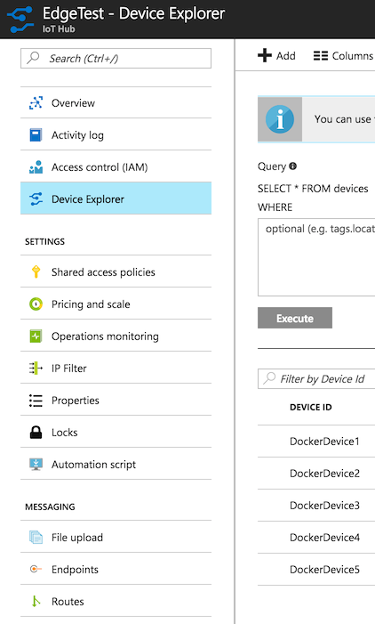

# iot-edge-container
[iot-edge](https://github.com/Azure/iot-edge)的容器部署方案


## 编译 & 运行

- 在电脑上安装[Docker](https://www.docker.com/) *(社区版就很好)

  **或**

  在树莓派的终端中运行以下命令
   ```
   curl -sSL https://get.docker.com | sh
   ```
   *备注：如果因为权限出错您可能需要使用sudo*

- 使用以下命令在本地克隆此存储库
  ```
  git clone git@github.com:IotInsiderLab/iot-edge-container.git
  ```

- [创建IoT Hub](https://docs.microsoft.com/en-us/azure/iot-hub/iot-hub-create-through-portal)

- 在Azure[门户](https://portal.azure.com/)，找到您创建的IoT Hub，并通过“DeviceExplorer”创建如下图所示的5个设备

  

- 使用您最喜欢的编辑器编辑simulated_device_cloud_upload_lin.json

  - 使用您创建IoT Hub名称替换 ```<insert iothub name here>```
  - 分别用上述步骤中创建的5个DockerDevices的 “主密钥”替换```<insert primary key here>```

- 从您最喜欢的命令终端中，切换到本地克隆这个资源库的文件夹中并运行以下命令。

  ```
  docker build -t iot-edge -f Dockerfile-x86 .
  docker run -ti iot-edge
  ```

- 在容器的终端中运行以下命令
  ```
  cd iot-edge/build
  samples/simulated_device_cloud_upload/simulated_device_cloud_upload_sample ../samples/simulated_device_cloud_upload/src/simulated_device_cloud_upload_lin.json
  ```
